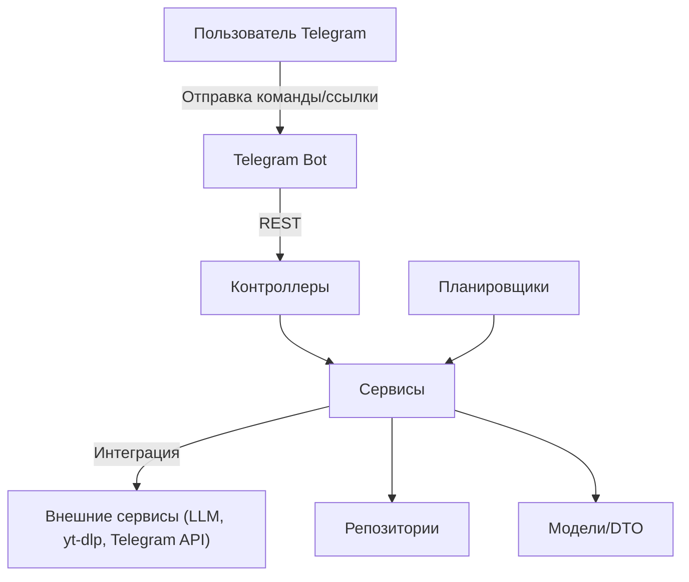

# Архитектура проекта

## Общая схема

Проект построен на базе Spring Boot и реализует микросервисную архитектуру с интеграцией внешних сервисов. Основные компоненты:

- **Контроллеры** — REST API для взаимодействия с внешними системами и пользователями
- **Сервисы** — бизнес-логика обработки контента, интеграция с LLM, Telegram и внешними источниками
- **Репозитории** — работа с базой данных (контент, события, пользователи и т.д.)
- **Планировщики (Scheduler)** — регулярные задачи для поиска и обработки контента
- **Клиенты** — интеграция с внешними API (OpenAI, DeepSeek, Telegram, yt-dlp и др.)
- **Утилиты** — вспомогательные классы для обработки текста, работы с файлами и т.д.

## Основные пакеты

- `controller` — REST-контроллеры
- `serivce` — сервисы (бизнес-логика)
- `scheduler` — задачи по расписанию
- `repository` — доступ к данным
- `model` — бизнес-сущности
- `dto` — объекты передачи данных
- `client` — интеграция с внешними сервисами
- `command` — команды Telegram-бота
- `listener` — слушатели событий
- `util` — утилиты
- `property` — параметры и настройки
- `exception` — обработка ошибок

## Взаимодействие компонентов

## Точка входа

- `VideoRetellingBotApp.java` — основной класс приложения, запускает Spring Boot и инициализирует все компоненты.

## Хранение данных

- Используется база данных для хранения контента, событий обработки, пользователей, каналов публикации и т.д.

## Интеграции

- **yt-dlp** — загрузка и обработка субтитров с YouTube
- **LLM (DeepSeek, OpenAI)** — генерация пересказов и оценок
- **Telegram Bot API** — взаимодействие с пользователями
- **Внешние источники статей** — регулярный парсинг и обработка 